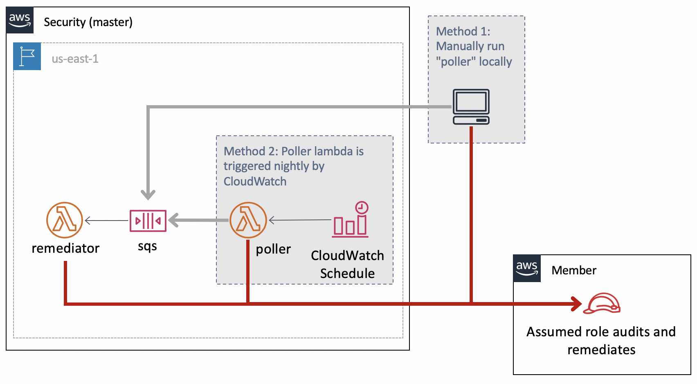
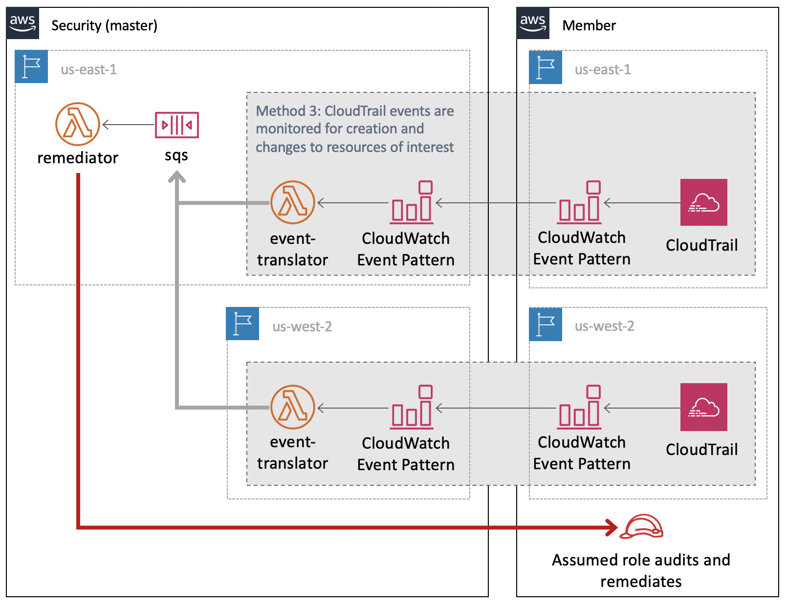

# AWS Remediation

This project identifies and remediates AWS security issues to ensure AWS usage is in compliance with a set of rules.  The general architecture of this project is to have identifying information about the resources in an account sent to an SQS. The SQS then triggers the `remediator` Lambda which will assume a role in the target account and audit, and potentially remediate, the resources.  The SQS receives information about resources via two methods, a nightly/cron based polling of all resources in the member accounts in the regions of interest, and via real-time events monitoring.

## Polling


Identifying all the relevant resources in the account can be done via the `poller` project.  This will make List and Describe calls in an account and convert each resource to a message like:
```
{
    "account": "000000000000",
    "region": "master-region",
    "type": "sqs",
    "id": "https://queue.amazonaws.com/000000000000/misconfiguration_maker-bad"
}
```

The `poller` can be run locally for testing or one-off situations, but is meant to be deployed as a Lambda that is triggered nightly via a CloudWatch Scheduled Event.  To run it locally, run:
```
python ./resources/poller/main.py --region us-east-1,us-east-2,us-west-1,us-west-2
```

Instead of the default functionality of printing these to the screen, you can add an `--sqs https://...` flag where you specify the SQS URL to use.

The `poller` is deployed in a single region with the SQS and `remediator` Lambda.  You must tell the `poller` which accounts to poll which can be done by setting the `ACCOUNTS` environment variable in the `./poller.tf` file.

The SQS triggers the `remediator` Lambda.  This assumes an IAM role into the account and region of the resource identifier it has been given.  It then makes Describe calls against this resource, and checks it to ensure it is in compliance.  Any issues found are sent to SNS `remediator_notifications` .  If the resource is not in compliance, and the Lambda has the environment variable `REMEDIATE` set to `true`, then the issues will be remediated (Not all types of issues have code to remediate them).

## Events


In order to respond more quickly to issues, there is an `event_translator` project that will setup CloudWatch Event patterns of CloudTrail logs to monitor for.  These will trigger the `event_translator` Lambda when events happen that create or modify resource types of interest.  These events are translated into the format needed for the SQS.

The `event_translator` must be deployed in every region in the Security account that you wish to receive events from.  This defaults to master-region,us-east-2,us-west-1, and us-west-2.


# Setting up the Master account
The project is expected to be deployed in any region, with some resources created in the specified regions.  It uses the S3 buckets created after running setup.sh. The created buckets follow `{bucket-name-prefix}-{region}` pattern. Example: `{bucket-name-prefix}-master-region` for master-region, and `{bucket-name-prefix}-us-west-2` (or similar names) for the other regions.  As S3 buckets are global resources, you may need to delete S3 buckets for running setup.sh again or input a different name for bucket-name-prefix.

#Preparing
There are some manual steps which needs to be done before you setup the master account.

1. Deciding `master-region` and `regions`. where master_region is the primary region where the remediator and poller function will live.
   export above to environment variables and keep it in sync with values of these fields in `./variables.tf` file
   ```
   export master_region=region-name
   export regions=region1,region2,region3,...

   example: export master_region=us-east-1
            export regions=us-east-1,us-east-2,us-west-1,us-west-2

   Update ./variables.tf file

   variable "master_region" {
     description = "master region where remediation function will live"
     default = "us-east-1"
   }

   variable "regions" {
     description = "list of aws regions to watch for misconfigurations"
     type = string
     default = "us-east-1,us-east-2,us-west-1,us-west-2"
   }

   ```
 2. Update below variables in `./variables.tf`, replace the defaults with accountid(s)
    ```
    variable "accounts" {
      description = "list of aws member accounts to watch for misconfigurations"
      default = "accountid-1,accountid-2,accountid-3"
    }

    variable "org_account" {
      description = "account id of Organization account"
      default = "org-account-id"
    }

    variable "dev_accounts" {
      description = "list of dev aws accounts to watch for additional checks"
      default = "dev-accountid-1,dev-account-id2,dev-account-id3"
    }


    ```
  3. Terraform currently doesn't allow for_each or count to iterate over modules. By default, `deploy.sh` would create event_translator in us-east-1, us-east-2, us-west-1, us-west-2 regions. If you want to add event-translator in additional region, update `./main.tf` file as below:
  Add below module and update {region} with the region you want (ensure that the additional region was specified in step 1.).
  ```
  module "events-{region}" {
  source        = "./event_translator"
  region        = "{region}"
  lambda_bucket = var.lambda_bucket
  function_name = var.function_name
  sqs           = aws_sqs_queue.resource_queue
  iam_role      = aws_iam_role.event_translator.arn
}

example:
module "events-eu-west-1" {
  source        = "./event_translator"
  region        = "eu-west-1"
  lambda_bucket = var.lambda_bucket
  function_name = var.function_name
  sqs           = aws_sqs_queue.resource_queue
  iam_role      = aws_iam_role.event_translator.arn
}
  ```
# Deploying
With a session/aws-credentials from your Security Account(or the account where you want remediator to live), run:
```

./setup.sh bucket_name_prefix
#bucket_name_prefix is prefix used for creating buckets with pattern {bucket_name_prefix}-{region}
example:  ./setup.sh abc_corp_remediation
```

`setup.sh` will create and tag the S3 buckets, and install the Python libraries in a local folder that will be used by the `remediator` Lambda later.  

Run:
```
./deploy.sh {bucket-name-prefix}  #keep the bucket-name-prefix same as the one used in setup.sh
example: ./deploy.sh abc_corp_remediation
```

The `deploy.sh` packages up the Lambda files as zips and copies them to the S3 buckets.  Then it runs terraform to set up all the other pieces of the architecture.

The terraform files consists of the following:
- `main.tf`: Creates the SQS that triggers the `remediator`, an SNS for alarms, an IAM role for the `event_translator`, and calls `./event_translator/event_translator.tf` for all regions.
- `./event_translator/event_translator.tf`: Opens the event bus so all accounts in the AWS org can send events to it, a region specific SNS (`remediator_event_translator_alarms`) for the event translator alarms, the `event_translator` Lambda, and CloudWatch Rule to trigger that Lambda.
- `poller.tf`: Creates the `poller` Lambda, the IAM role needed for it, and the alarms for it.
- `remediator.tf`: Creates the `remediator` Lambda, the IAM role needed for it, and the alarms for it.

A SNS named `remediator_alarms` will be created in master-region that you should subscribe to in order to be informed about any errors or other monitoring concerns.  There is also an SNS for the `event_translator` named `remediator_event_translator_alarms` in all regions, that you should subscribe to.

A SNS named `remediator_notifications` will be created in master-region that you should subscribe to in order to be notified about the findings and automated remediation.

By default no remediations will be performed.  To enable remediations, you need to change the `remediate` variable to `true` in the `./variables.tf`.

Another variable in `./variables.tf`, `S3_BUCKET_IGNORE_LIST`, allows for a comma-separated list of S3 buckets to ignore, by not remediating.

**Do NOT deploy this with remediations turned on until you have verified what issues it has identified to ensure production resources will not be broken/destroyed via "remediation".**  Once remediations are turned on, it will attempt to remediate any type of resources in any accounts it is told about, so in addition to turning on remediations for the first time, be careful about onboarding new accounts with existing resources.

## Setting up the member accounts
By Default `event_forwarder` is configured for us-east-1,us-east-2, us-west-1 and us-west-2 regions. if you want to add more regions to watch for, you can update `../member_account_setup/main.tf` file to add the module for the new region:
```
module "event-forwarder-{region-name}" {
  source = "./event_forwarder"
  region = "{region-name}"
  master = var.master
  role_arn = aws_iam_role.event_forward.arn
}

example:
module "event-forwarder-eu-west-1" {
  source = "./event_forwarder"
  region = "eu-west-1"
  master = var.master
  role_arn = aws_iam_role.event_forward.arn
}
```
For the additional accounts that you want to monitor, from the `member_account_setup` directory, while your environment variables are populated with credentials for the other accounts (via aws-okta or similar) run:

```
terraform apply -var="master=master_account_id" # where master_account_id is the account-id of the account where remediator, poller was deployed.
```

The member account setup does the following:
- Creates the IAM role `member_remediator` for the Master account to assume into.  This has privileges for both the `poller` and the `remediator`.
- Creates the CloudWatch Events rule to watch for the events of interest and sends these to the Master account so they get seen by the `event_translator`.

## Notification
All identified issues are sent to SNS `remediator_notifications` in `master_region`.

## Uninstalling

For each member account, from `member_account_setup` while your environment has credentials for the member account, run:

```
terraform destroy
```

In the master account, from the main directory, similarly, run:

```
terraform destroy
```

You can also remove the S3 bucket `{bucket-name-prefix}-{region}`.

# Resource and Module Exceptions
There are multiple variables in ./variables.tf which would mark resources exempt from remediation.
1. `ec2_ignore_list` -  for ignoring remediation of publicly exposed dev(characterized by accounts in `dev_accounts` variable) ec2   instance(s)
2. `s3_bucket_ignore_list` - for ignoring remediation of specified S3 bucket.
3. `remediation_module_exception` - for ignoring remediation module(s) for specific account(s). example - `"123456789012":["ami"]` will disable ami remediation for account 123456789012.
4. `remediation_resource_exception` - for ignoring remediation for any resource, specify resource identifiers seperated by `,` example: "snap-abcd,ami-abcd" will not remediate the specified resources.

TODO - remove 1 and 2 and make 4 a key based exception list - {"s3":["test-bucket-1","test-bucket-2"],"ami":"ami-abcd"}  

# Testing
Unit tests can be run with:

```
python3 -m venv ./venv && source venv/bin/activate
pip install -r requirements.txt
./tests/scripts/unit_tests.sh
```

Unit test code coverage must exceed 70% or will fail.

## Misconfiguration maker

The `misconfiguration_maker` project creates a number of non-compliant resources. The misconfigurations they have are limited so there is little danger of deploying this in even a sensitive production account. The purpose of this project is to have real tests of the compliance checks.

To deploy this, with a terminal session inside the `misconfigruation_maker` directory, run:
```
terraform init
terraform apply
```

# Running locally
You can poll for the resources in an account with the poller project. The following shows how to do this such that only the resources created by the `misconfiguration_maker` are output, and this output goes to stdout (as opposed to the SQS).  It then pipes those directly to the `remediator` project (again run locally).  In order to test this between accounts, or for other reasons, you may wish to send the output of the poller to a file, potentially edit it manually, and then cat it to the `remediator`.

```
python ./resources/poller/main.py --region master-region --only_use_test_resources --stdout | python resources/remediator/main.py
```

The `remediator` will not remediate the issues unless the `--remediate` flag is passed or an environment variable named `REMEDIATE` is set to `true`.

# Development
This section describes things to know to expand the project to new compliance checks.  All new code should have unit tests added for it.  To run the unit tests, run: `./tests/scripts/unit_tests.sh` as described above.  When this is run, a code coverage report is generated.  In a terminal session in the `./htmlcov` directory, run `python3 -m http.server --bind 127.0.0.1` to run a local webserver, that can be accessed at http://127.0.0.1:8000/  There you'll be able to see how much code coverage each file has, and which lines specifically have and have not been covered during testing.


## Identifying the resource
1. Extend `misconfiguration_maker/main.tf` to create the new resource with the non-compliant feature.  This will give you something to test against.
1. Extend the poller via `./resources/poller/main.py` to find the new resource.  Ensure this supports the ability to only output the misconfiguration_maker created resources.
1. Add the required IAM privileges to find this resource to `member_remediator_policy_document` in `./member_account_setup/main.tf`
1. Extend `tests/unit/test_poller.py` to get code coverage for the new statements.

## Identifying the events for the resource
1. Look for the creation event in CloudTrail Event History and copy the event.
1. Extend the event_translator via `./resources/event_translator/main.py` to detect this event.
1. Add the event pattern to the `aws_cloudwatch_event_rule` in `./member_account_setup/events_to_watch.json`
1. Extend `tests/unit/test_translator.py` by copying one of the existing test functions and then pasting in the CloudTrail event copied from earlier to the `detail` element of the json.  You will need to change any instances of `true` to `True` and `null` to `None` so it matches Python's rules.
1. Review the other AWS APIs for this resource to identify ones that may be able to set, change, or create this feature.  For example, an RDS might be created without encrypted via `rds:CreateDBInstance` or the encryption might be disabled later via `rds:ModifyDBInstance`. Test them and repeat the steps involved with looking for those events in CloudTrail Event History.

## Auditing and remediating the resource
1. Copy one of the existing files in `./remediator/auditors/`.  The name you give the file must be the resource type. Edit this file to perform the checks and remediations.
1. Add the name of the file to the `__all__` array in `./remediator/auditors/__init__.py`.  This ensures the file is called when this resource type is seen in the SQS.
1. Add the required IAM privileges to check and remediate this resource to `member_remediator_policy_document` in `./member_account_setup/main.tf`
1. Extend the unit tests in `tests/unit/test_auditors.py`.  Copy one of the existing test functions.  This will call your auditor code, but it running the unit tests will result in an error of `Unknown service`.  You'll need to add mocked functions to the function `mocked_get_session_for_account_side_effect`.   Create a class for the type of service involved, and then functions for that class that match the boto functions.  At the bottom of `mocked_get_session_for_account_side_effect` is a series of checks for services, such as `if service == "ec2": return Ec2()` where you'll need to add your service.  Within your mocked functions you can also changed the output depending on the identifier, which allows you to make assertions for both compliant and non-compliant mock resources.

Finally, you'll need to redeploy everything by running `./deploy.sh` in the master account, and updating the terraform deployments of all member accounts.


## Events monitored
The file `./member_account_setup/events_to_watch.json` contains the events that are monitored. As a json file, it cannot have comments, so I'll describe the actions that are monitored here:

```
# SQS
"CreateQueue",
"SetQueueAttributes",
"AddPermission",

# AMI
"ModifyImageAttribute",

# EBS Snapshot
"ModifySnapshotAttribute",

# RDS Snapshot
"ModifyDBSnapshotAttribute",

# RDS
"ModifyDBInstance",
"CreateDBInstanceReadReplica",
"CreateDBInstance",

# RDS Aurora
"ModifyCluster",
"CreateCluster",

# S3
"CreateBucket",
"PutBucketPolicy",
"PutBucketAcl",

# Security group
"AuthorizeSecurityGroupIngress",
"CreateSecurityGroup",

# ELB
"RegisterInstancesWithLoadBalancer",

#EC2
AssociateAddress,
RunInstances,

#ELBv2
RegisterTargets",
"CreateListener",
"ModifyListener",

#LAMBDA
"AddPermission20150331v2",
"CreateFunction20150331",

#IAM
"CreateRole",
"UpdateAssumeRolePolicy"
```

# Remediations

| Resource type | Check | Remediation | Misconfiguration maker |
| --- | --- | --- | --- |
| Region | GuardDuty is enabled and connected to the Master account | - | - |
| Region | Config is enabled and connected to the Master account | - | - |
| Region | CloudTrail is enabled and connected to the Master account | - | - |
| Region | VPC Flow Logs are enabled for every VPC | - | - |
| Region | Root has MFA (master-region only) | - | - |
| Region | Password policy is set (master-region only) | - | - |
| AMI | No AMIs are public or shared with unknown accounts | Unshares the AMI from being public or the unknown account | Creates an AMI that is shared with 000000000000 |
| EBS snapshot | No EBS snapshots are public or shared with unknown accounts | Unshares the snapshot from being public or the unknown account | Creates an EBS snapshot that is shared with 000000000000 |
| IAM user | All IAM users with password logins, created over 24 hours ago, have MFA | Remove password login| Creates an IAM user with username and no MFA (will not be detected or remediated for 24 hours) |
| IAM user | All IAM users with password logins, must have logged in within 90 days | Remove password login | - |
| IAM user | All IAM users with access keys must have used them within 100 days | Remove the access keys | - |
| RDS snapshot | No RDS snapshots are public or shared with unknown accounts | Unshares the snapshot from being public or the unknown account | Creates an RDS snapshot that is shared with 000000000000 |
| RDS | No RDS is unencrypted | Stops the RDS instance | Creates an RDS that is not encrypted |
| RDS | No RDS is public | Removes the PubliclyAccessible attribute | - |
| RDS | Has required tags | Stops the instance | - |
| Redshift | No Redshift is unencrypted | Turns on encryption | Creates a Redshift cluster that is not encrypted |
| Redshift | No Redshift is public | Removes the PubliclyAccessible attribute | Creates a Redshift cluster with the publicly accessible attribute |
| Redshift | Has required tags | - | - |
| Redshift | Requires TLS | - | Creates default Redshift cluster which does not require TLS |
| S3 | No bucket is public via ACL or Policy | Adds the Private ACL or adds a policy that denies adding objects | Creates a randomly named S3 bucket that grants public access to s3:GetBucketAcl |
| S3 | Enforces server side encryption via bucket policy | Sets a default policy | " |
| S3 | Enforces TLS via bucket policy | Sets a default policy | " |
| S3 | Bucket policy does not grant access | Sets a default policy | " |
| S3 | Has required tags | - | - |
| SQS | No SQS is public | Deletes the policy | Creates an SQS that allows public sqs:SendMessage |
| EC2 | IMDSv2 is enforced | Enforces IMDSv2 | Creates a default EC2 (which does not have IMDSv2 enforced) |
| EC2 | Has required tags | Stops the instance | - |
| EC2 | No EC2 instance is public in dev accounts| Stops/Terminates the instance| - |
| Security Group | Does not allow 0.0.0.0/0 | - | - |
| ELB | Has required tags | - | - |
| ELB | Tags of associated EC2s match the ELB | - | Creates an ELB with a mismatched tag of the associated EC2 |
| ELB | No EC2 instance is public in dev accounts via ELBv1| De-registers the instance | - |
| ELBv2 | No EC2 instance is public in dev accounts via ELBv2| De-registers the instance | - |
| IAM ROLE | No IAM Role should be publicly exposed | Update the Trust Relationship | - |
| LAMBDA | No Lambda should be publicly exposed | Update the resource policy | - |
